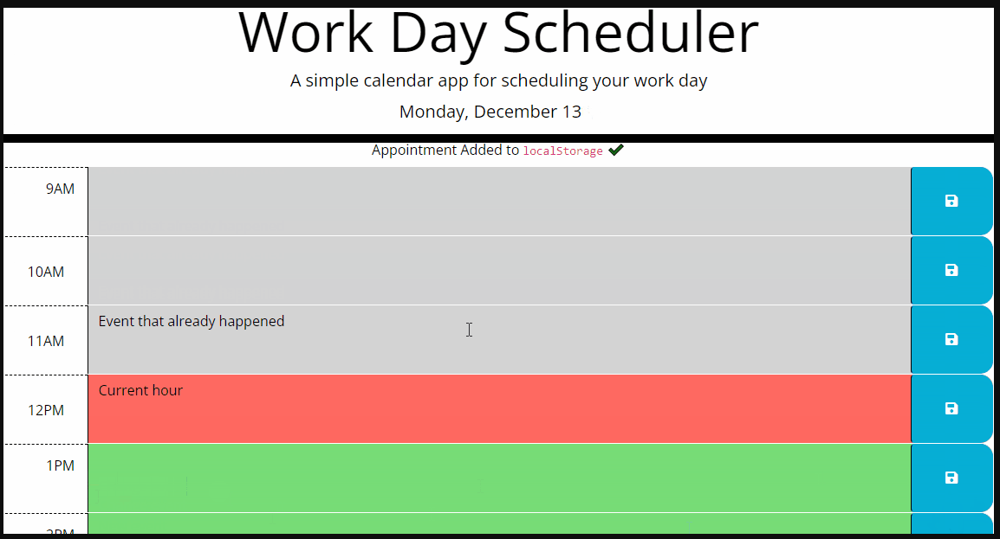

# Work Day Scheduler

## Description

This week's challenge allows the bootcamp students to create a simple calendar application that allows a user to save events for each hour of a typical working day (9am–5pm) by modifying starter code. This app will run in the browser and feature dynamically updated HTML and CSS powered by jQuery. The Day.js library will also be used for this app. 

## Installation

N/A

## Usage

To use the Work Day Scheduler Application, you can copy and paste this link into your browser: https://miloyang.github.io/Work-Day-Scheduler

The page should open as per below screenshots:

The HTML, CSS and Javascript code can be seen when you open the Chrome DevTools by pressing Command+Option+I (macOS) or Control+Shift+I (Windows). A console panel should open either below or to the side of the webpage in the browser. Head into the Elements, Styles and Sources tab, and there you will see the codes. 

When the page has been loaded, the current date and time should be displayed on the header. 

The timeblocks for standard business hours (9am - 5pm) will be shown in 3 different colours. The "past" hours will be in grey, the "present" hour will be in red and the "future" hour will be in green. 

When you click on a time block, you will be able to enter an evnet. 

When you click on the save button, the text of the event is saved to local storage alongside with a timed (2 seconds) message saying the appointment has been added to local storage.

When the page is refreshed, the saved event will remain on the page. 

## Credits

Coding Bootcamp by USYD x EDX

## License

Please refer to the LICENSE in the repo.
